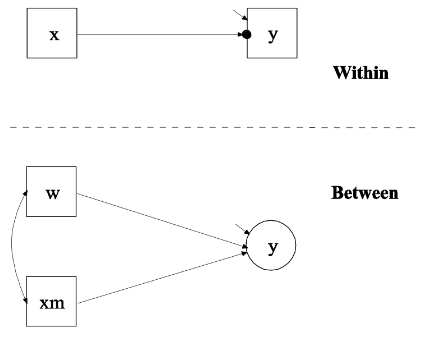

<style type="text/css">
body{ font-size: 20px; max-width: 1600px; margin: auto; padding: 1em; }
code.r{ font-size: 18px; }
p { padding-top: 10px; padding-bottom: 10px; }
pre { font-size: 16px; }
</style>


注意我们的教程和代码以 `Rmd` 格式的文件存储， 这种文件是R代码常用格式， 我们的教程需要预先安装 Mplus . 

你可以使用Mplus的免费版: https://www.statmodel.com/demo.shtml

免费版有很多限制：

1.  Maximum number of dependent variables: 6
2.  Maximum number of independent variables: 2
3.  Maximum number of between variables in two-level analysis: 2
4.  Maximum number of continuous latent variables in time series analysis: 2

1.因变量最大数量：6
2.自变量最大数量：2
3.二水平分析中变量间最大数量：2
4.时间序列分析中连续潜变量的最大数量：2

现在“lavaan”的作者 Yves Rosseel 已经更新了 lavaan 这个R的代码包， 它已经可以做多水平的结构方程模型了， 但是因为本教程撰写之初，
lavaan 并没有完全支持多水平分析， 所以本教程并不是使用lavaan做结构方程， 而是在底层使用了mplus， 但是是在R的语言环境下使用的. 

本篇教程先介绍多水平结构方程的基本概念, 有一些数学符号可能难以理解, 
但是不要担心, 本教程不是给专家看的, 所以我们针对入门学生的一些常见问题进行讲解,
即便无法理解理论部分, 只要你遵循我们的指导也可以完成一篇合格的多水平结构方程的分析报告.

本篇教程主要使用mplus软件, Mplus 可能是好用的多水平结构方程软件，尽管 EQS 和 LISREL 中也有类似的功能.  
此外，R 中的 OpenMx 包是免费的，支持多级分析，但需要采用截然不同的语法和规范方法, 适合会R语言的童鞋.

这篇教程虽然使用了mplus, 但是我们建议你使用 R 的一个工具库 MplusAutomation, 这个工具库帮助你完成非常无聊的结果整理工作, 
因为 Mplus 输出的结果是文本文件, 难以转换为表格, 难以对比不同模型的结果, 所以我们鼓励你使用 MplusAutomation 这个工具, 
它可以自动帮你完成这个功能. 如果对R比较陌生， 可以看我们录制的R语言的快速入门视频教程, 因为学习编程的诀窍只有一个, 
就是快速入门, 快速应用, 视频放在这里[《R语言快速入门教程》](https://www.bilibili.com/video/BV1Wt4y1g7rn/)

```{r setup, include=FALSE}
if (!require(pacman)) { install.packages("pacman"); library(pacman) }
p_load(knitr, MASS, tidyverse, lavaan, modelr, semPlot, semTools, DiagrammeR, MplusAutomation, texreg, lme4)
knitr::opts_chunk$set(echo = TRUE) #print code by default
options(digits=3)
set.seed(15092) #to make simulated data the same across computers

#small function to plot all SEM diagrams using
semPaths_default <- function(lavObject, sizeMan=15, ...) {
  require(semPlot)
  semPaths(lavObject, nCharNodes = 0, sizeMan=sizeMan, sizeMan2=4, sizeLat = 13, sizeLat2=7, ...)
}

#Where the mplus binary lives on my computer. Only needed if installed in a non-standard location.
mbin <- "/Users/mnh5174/Applications/Mplus/mplus"
```

# 什么是多水平模型(不限于多水平结构方程模型)

从一般的线性模型开始, 然后逐渐引入多水平的概念. 你可以看下一般的线性回归模型:

$$
\begin{align*}
Y &= B_0 + B_1 X_1 + B_2 X_2 + ... B_p X_p + \varepsilon \\
\varepsilon &\sim \mathcal{N}(0, \sigma^2)
\end{align*}
$$

一般的线性模型理解起来非常简单, p个预测变量x, 通过线性组合, 来对被预测的变量Y进行预测. 但是这个模型有一个前提, 就是样本之间没有相互依赖, 
或者说, 回归残差ε是独立同分布的. 但是如果你的样本是重复测量的, 你可能会得到下面这样的样本数据:

重复测量的数据格式通常包括两种主要类型：长型格式和宽型格式. 

- 长型格式：在这种格式中，每个受试者的每次重复测量都会作为一条独立的记录. 例如，如果一个受试者被重复测量了四次，那么该受试者就会有四条记录. 每条记录都包含受试者的标识信息以及对应的测量值. 这种格式的优点在于可以清晰地展示每次测量的具体情况，但可能会导致数据集的行数较多. 
- 宽型格式：这是数据分析时最常用的格式. 在这种格式中，每个受试者只有一条记录，而重复测量的数据则作为该记录的不同变量. 例如，如果一个受试者被重复测量了四次，那么这四个测量值就会作为该受试者的四个不同变量. 这种格式的优点在于可以简化数据集的结构，方便进行统计分析，但可能需要对数据进行适当的转换和重构. 

如果是长型格式 , 你看下面的数据, 同一个被试会在不同的时间点测量4次, 那么同一个被试的4个样本是高度相关的, 这时候不可以直接使用一般线性回归分析.

| 被试ID | 测量轮次 | 测量值 |  
| :--: | :--: | :--: |  
| 001 | 1 | 25.5 |  
| 001 | 2 | 26.2 |  
| 001 | 3 | 25.8 |  
| 001 | 4 | 26.1 |  
| 002 | 1 | 24.9 |  
| 002 | 2 | 25.3 |  
| 002 | 3 | 25.1 |  
| 002 | 4 | 25.5 |  
| ... | ... | ... |

常见的多水平数据还有下面几种:

- 嵌套在个体中的实验任务的试验（例如，反应时间或准确性数据） 
- 在每只动物中测量一组神经元（例如，群体），但目的是描述一组动物的模式 
- 问卷或调查的纵向测量 
- 基于访谈的数据 
- 同一个班级的学生
- 治疗组内的患者

在每种情况下，多水平分析（包括多水平 SEM）的目标是明确解释簇内和簇间的变异性.  如果我们要分析数据而忽略群体结构，我们就会高估自由度（因为我们的观察是非独立的,没有那么自由）.  我们无法区分簇内和簇间的影响； 相反，我们的参数将反映两种效应的混合, 这使得我们得出错误的结论.

## 水平间效应

多水平分析还允许研究人员在模型的每个水平提出具体问题.  
让我们考虑一下学生 (L1层面) 嵌套在学校 (L2层面) 内的情况. 
 在学校层面，我们假设学生与教师的比例会影响阅读成绩，因此每位教师的学生越多，成绩越差.  
 根据定义，学生与教师的比例仅作为学校层面的变量才有意义（因为同一所学校的学生有类似的师生比例, 
 这个变量不随学校内学生的变化而变化），在个人层面上没有变化.  这可能看起来像下面这样的数据:

```{r}
tt <- dplyr::tribble(
~student, ~school, ~stratio, ~readtest,
1, "Radio Park", 20, 15,
2, "Radio Park", 20, 12,
3, "Radio Park", 20, 19,
4, "Corl Street", 16, 24,
5, "Corl Street", 16, 27,
6, "Corl Street", 16, 21
)

kable(tt)
```

- 第一列 student 是学生的编号. 
- 第二列 school 是学生所在的学校名称. 
- 第三列 stratio 是学生所在学校的师生比，即每个老师负责的学生数量. 从数据中可以看到，Radio Park 学校的师生比是20，而 Corl Street 学校的师生比是16. 
- 第四列 readtest 是学生的阅读测试分数. 


请注意，stratio在同一个学校下没有变化.  这是预测变量最简单的情况，因为不用担心它可能代表学生和学校效应的混合.  也就是说，stratio 无法预测任何 L1 方差(即同一个学校内学生阅读成绩的变化不可能是师生比决定的). 

用方程来表示变量的关系就是:

$$
\begin{align*}
\textrm{readtest}_{ij} &= \beta_{0j} + r_{ij} \\
\beta_{0j} &= \gamma_{00} + \gamma_{01} \textrm{stratio}_j + \mu_{0j} \\
\end{align*}
$$

第一个方程没有预测变量(自变量), j是学校代码, 
i是学生代码, 那么 $\beta_{0j}$ 意思是学校的阅读成绩平均分, 同一个学校的学生有同一个值, 
$r_{ij}$是学生的离均差, 即偏离所在学校的平均值 $\beta_{0j}$ 的大小. 
第二个方程 $\gamma_{00}$ 是所有学校所有同学的总平均分, 师生比会影响到学校的平均成绩， 师生比的效应是 $\gamma_{01}$ .  这个模型没有纳入任何个体层面的变量， 但是这个模型是帮助你理解什么是多水平模型的：
师生比通过影响学校平均水平$beta_{0j}$ 进而影响到了学生的成绩${readtest}_{ij}$.  
$\beta_{0j}$ 带有角标j, 说明它是一个变量, 但是它是未知的, 被称作随机截距. 

所以我们通常还会写一个整体模型:

$$
\begin{align*}
\textrm{readtest}_{ij} &= \gamma_{00} + \gamma_{01} \textrm{stratio}_j + \mu_{0j} + r_{ij}
\end{align*}
$$

我们只是把第二个等式替换到第一个等式中的 $\beta_{0j}$. 
你注意看小角标 i 和 j, 例如 $stratio_j$ 只有角标j, 说明在个体间同一个学校内是不变的. 


下面我们继续丰富我们的模型, 纳入个体层面的变量$readpermin$, 它用于测量学生的阅读速度, 案例数据如下:


```{r}
tt <- tt %>% add_column(readpermin=c(20, 14, 18, 25, 35, 30), .before="school")
kable(tt)
```

## Disaggregating within- versus between-cluster effects

## 区分组间和组内效应

下面的模型可以将阅读速度纳入:

$$
\begin{align*}
\textrm{readtest}_{ij} &= \beta_{0j} + \beta_{1} \textrm{readspeed}_{ij} + r_{ij} \\
\beta_{0j} &= \gamma_{00} + \gamma_{01} \textrm{stratio}_j + \mu_{0j}
\end{align*}
$$

$\beta_{1}$是阅读速度的系数, 它没有角标, 意味着它是一个固定效应, 它在所有个体和所有学校之间都是不变的.


重要的是, 个体层面的预测变量与结果变量(被预测变量)之间的关联可以反映个体之间的差异, 也可以反应学校的差异. 
也许学生的阅读速度更快是因为个人层面因素(某种气质类型),  或者一些学校可能有促进更好阅读的政策，因此平均阅读速度因学校而异）.
所以上面的模型并不能反映真实的情况. 那么我们可以让固定效应$\beta_{1}$变成随机效应, 模型这样写:


$$
\begin{align*}
\textrm{readtest}_{ij} &= \beta_{0j} + \beta_{1j} \textrm{readspeed}_{ij} + r_{ij} \\
\beta_{0j} &= \gamma_{00} + \gamma_{01} \textrm{stratio}_j + \mu_{0j} \\
\beta_{1j} &= \gamma_{10} + \mu_{1j}
\end{align*}
$$

$\beta_{1j}$是未知的, 因为有角标j, 代表随学校的不同而不同, 但在同一个学校内的个体间变化. 

由于阅读速度是一个 L1 变量（即个人/学生），
因此它可能在个人 (L1) 和学校 (L2) 层面上都有系统性的变化。 
在传统的多级建模 (MLM) 中，可以使用适当的中心化方法来分离每一级的变异（Curran & Bauer，2011）。 
例如，通常的方法是将预测变量（阅读速度）减去学校平均值(注意每个学校有不同的平均值奥)，
这样我们现在就有一个变量来表示阅读速度相对于学校平均值的变化, 这个新的变量放入L1层的模型就可以排除学校层面变异的影响。 
然后，我们还以学校均值(这是一个变量,因为每个学校有不同的平均阅读苏速度)并将其作为 L2 的预测变量。
这样，就可以具体考察每所学校的阅读速度对考试成绩的影响。 
同样，也可以检查学校平均水平无法解释的阅读速度的个体差异。

我们使用这种方法将阅读速度进行中心化:

$$
\dot{\textrm{readspeed}_{ij}} = \textrm{readspeed}_{ij} - \bar{\textrm{readspeed}_{j}}
$$

$\bar{\textrm{readspeed}_{j}}$是每个学校的阅读速度均值, 它随学校的不同而不同, 所以它是L2层面的变量; 
$\dot{\textrm{readspeed}_{ij}}$以学校均值为中心的阅读速度, 它反映了个体阅读速度的差异, 所以它是L1层面的变量.
这两个变量可以整合到模型中:

$$
\begin{align*}
\textrm{readtest}_{ij} &= \beta_{0j} + \beta_{1j} \dot{\textrm{readspeed}_{ij}} + r_{ij} \\
\beta_{0j} &= \gamma_{00} + \gamma_{01} \textrm{stratio}_j + \gamma_{02} \bar{\textrm{readspeed}_{j}} + \mu_{0j} \\
\beta_{1j} &= \gamma_{10} + \mu_{1j}
\end{align*}
$$

$\gamma_{02}$是L2层面的阅读速度的固定效应, 反映了学校整体阅读速度的变化对学生整体阅读成绩的影响;
$\beta_{1j}$是L1层面的阅读速度的随机效应, 也就是不同学校学生的阅读速度对阅读成绩的效应是不同的, 
不过你也可以假定为固定效应, 那就是不同学校有相同的效应, 写为 $\beta_{1}$.

$$
\textrm{readtest}_{ij} = ( \gamma_{00} + \gamma_{01} \textrm{stratio}_j +
\gamma_{02} \bar{\textrm{readspeed}_{j}} +
\gamma_{10} \dot{\textrm{readspeed}_{ij}} ) + \\
( r_{ij} + \mu_{0j} + \mu_{1j} \dot{\textrm{readspeed}_{ij}} )
$$
Note how $\textrm{readspeed}$ enters the model in two ways (individual and school level). As in previous examples, the fixed effects are denoted in the first set of parentheses, and the random effects in the second.

# Multilevel SEM (MSEM) overview

Okay, so we've got our head around standard multilevel models. Where does SEM enter the picture? In multilevel SEM, we use a latent variable approach to parcellate variation between and within clusters, rather than applying a cluster-based centering approach. This is the intuition:


In this representation, we view the observed variables as jointly caused by within- and between-cluster variation as latent variables.

Importantly, this framework also allows for the specification of random slopes such that within-person/cluster variation in the strength of an association between two variables can *itself* be a latent variable at the between-person level. For example, does the within-person association of reading speed with performance depend on student:teacher ratio? Said differently, does student:teacher ratio moderate the relationship between reading speed and performance? This is the multilevel SEM equivalent of *cross-level interaction* in MLM. Our graphical notation is as follows:


So far, however, the expression of multilevel data in a SEM framework has not revealed any new capabilities beyond standard MLM. Why would one consider multilevel SEM? First, some people find it easier to conceptualize of multilevel data structures and models within the SEM framework where we are used to path diagrams. Second, as in other non-multilevel analyses such as mediation, multilevel SEM offers the ability to test hypotheses involving several variables and paths. For an excellent introduction to the value of SEM for testing multilevel mediation, see Preacher, Zyphur, and Zhang (2010), *Psychological Methods*. Third, multilevel SEM allows us to test hypotheses involving *latent* variables, which are hard to implement in standard MLM. In particular, we can consider measurement models in which the covariation among a set of indicators is thought to reflect a latent variable. Fourth, the approach of cluster-mean centering introduces a potential bias in the between-group variance. In particular, having few level 1 observations and a low intraclass correlation will bias estimates of between-cluster effects (Lüdtke et al., 2008). This is especially problematic in cross-level mediation, where it is essential to treat the L1 portion of variance as a latent variable to recover unbiased parameters (Asparouhov & Muthén, 2006). In short, the latent decomposition of within-between in MSEM tends to provide better estimates than the centering method in MLM. 

## Sampling perspective

In MSEM, we have the option of whether to approach clustering from a (population) sampling perspective or a multilevel perspective. The sampling perspective is more typical in epidemiological or demographically representative studies in which we use stratified random sampling to cover the population of interest. This often involves computing sampling weights in which we might try to weight each set of observations so that the overall sample matches the composition of the population. For example, if we undersample African-American males, but wish to include them in the population to which we generalize, we might overweight those observations accordingly so that the parameters are more representative of the general population.

This problem also occurs in situations where individuals are nested in neighborhoods, cities, or states, but we wish to generalize to the overall population (e.g., adults in the USA). Again, we might reweight observations in the estimation in order to estimate a model that is representative of the population of interest. Thus, if we oversample Colorado and undersample Idaho, reweighting could help us recover unbiased parameters that correct for this problem.

According to the sampling perspective, clustering is an important feature of the data, but primarily because we wish to 'uncluster' the data in a representative fashion. That is, we are not interested in whether Colorado or Idaho has higher prevalence rates of depression, but instead we wish to estimate the prevalence of depression in the USA, accounting for the design of the epidemiological survey. If any/all of these questions pertain to your dataset or interest, see the `lavaan.survey` package, which is an add-on to `lavaan` that provides the functionality to handling design weights, clustering, and stratification. For example, we might wish to remove the effect of interviewer on prevalence estimates, rather than examine within-interviewer versus between-interviewer predictors. This could be done by setting up a `svydesign` object in which we account for clustering by interviewer.

FYI, the sampling perspective on clustered data is implements in Mplus using the `TYPE=COMPLEX` specification in the `ANALYSIS` section.

## Multilevel perspective

By contrast, the multilevel perspective on clustered data is that we are specifically interested in parcelling variance at each level of the data structure so that we could examine predictors that explain variance at each level. For example, some researchers in our department (e.g., Dever Carney and Louis Castonguay) are interested in what are the client (L1), therapist (L2), and center/clinic (L3) factors that predict treatment outcomes in psychotherapy. As we talked about above, if a predictor exists at a lower level of the hierarchy (e.g., L1), it may nevertheless have systematic variance at higher levels. Thus, a client factor such as perceived therapeutic alliance may explain client-specific outcomes (L1), but alliance may also vary at the therapist level such that the clients of some therapists (L2) rate alliance higher, on average, relative to other therapists. Thus, even though we view alliance as the experience of a *client*, therapist-average alliance may explain why clients of some therapists do better than others. This is why the disaggregation approach mentioned above is crucial to resolving such questions: within-cluster centering, inclusion of cluster means.

In MSEM, we have the option of using the conventional centering strategy or use latent decomposition (as mentioned above) to disaggregate variance for a lower-level variable at each level.

In Mplus, we use `TYPE=TWOLEVEL` or `TYPE=THREELEVEL` in the `ANALYSIS` section to specify a multilevel model.

# Multilevel SEM specification

The formal specification of multilevel SEM (Muthén & Asparouhov, 2008) is:

$$
\boldsymbol{Y}_{ij} = \boldsymbol{\nu_j} + \boldsymbol{\Lambda}_j\boldsymbol{\eta}_{ij} + \boldsymbol{K_j}\boldsymbol{X}_{ij} + \boldsymbol{\varepsilon}_{ij}
$$

As in non-multilevel SEM, $\boldsymbol{\nu}_j$ captures the intercepts of the variables, but allowing these to vary by cluster. And as usual, we have factor loadings ($\boldsymbol{\Lambda}_j$), factor scores (\boldsymbol{\eta}_{ij}), and the influence of exogenous covariates $\boldsymbol{X}_{ij}$. The important point is that all of these can potentially vary by cluster. I'll spare you the details on how MSEM parcels the structural and measurement models at the within and between levels... But the MSEM can be estimated using maximum likelihood in the typical fashion, with variance being assigned to the appropriate level by latent variable estimation.

# A bit about Mplus MSEM syntax

Unlike `lavaan`, which is a package for `R` that follows most `R` conventions, Mplus is a standalone program that has its own syntax. Although Mplus cannot compete with the all-purpose functionality of `R` for data management and visualization, Mplus has developed a host of useful features for manipulating data, such as within-cluster centering or computing interaction terms.

The basic paradigm of Mplus is that a model consists of three parts: data, model syntax, and model output. By convention, the raw data are provided as a tab-separated file with no column headers, typically using the extension .dat. The Mplus model syntax has its own conventions, such as the use of `ON` to denote the regression of `Y ON X`. Likewise, `WITH` denotes the undirected (residual) association of `X WITH Y`. And factors are specified using `BY`, as in 'measured by': `F1 BY X1 X2 X3`. Mplus syntax also has major sections that define important components of the model, such as the estimator, what data are categorical, what additional outputs to provide, and so on.

By convention, Mplus syntax files are stored as text with the extension .inp. And the output provided by Mplus is also text, stored as .out. There is an impressive array of information in the output file, but its storage as text makes it time-intensive to sift through each section. This is where the `readModels()` command from `MplusAutomation` can help index a number of output files by storing the information in R-friendly data structures such as lists and data.frames.

## WITHIN

If a variable is specified as `WITHIN` in the `VARIABLE` section, then it is assumed to vary *only* within clusters and to have no between component. In the latent decomposition, the between component of the variable is zero. Thus, this statement is used when 1) the variable varies at the within-cluster level, and 2) we wish to assign the totality of its variance at the within-cluster level, assuming that there is no between component.

## BETWEEN

If a variable is specified as `BETWEEN` in the `VARIABLE` section, it is a cluster-level variable that has no variation within-cluster. These are typically called L2 variables. For example, student:teacher ratio would be a `BETWEEN` variable if we are examining students nested in schools.

## Neither WITHIN nor BETWEEN

If we do not specify that a variable is `WITHIN` or `BETWEEN` then Mplus will model its variance at both levels. That is, it will use latent decomposition to parcellate the variance into within- and between-cluster variance. At the between-cluster level, this means we are modeling the random intercept of that variable.

# Getting started with MSEM in Mplus

Let's start with a simple multilevel model that we could fit using conventional MLM software. This is Example 9.1 from the Mplus user's guide.

## Centering approach to disaggregation



The dot on the $y$ box denotes a random intercept of y. That is, there is between-cluster variation in the average level of $y$ that can be modeled at the between level. $x$ is the person-centered L1 predictor. $xm$ is the person mean on $x$. $w$ is a cluster-level covariate (i.e., no within variance).
```
TITLE:	this is an example of a two-level 
	regression analysis for a continuous 
	dependent variable with a random intercept and an observed covariate
DATA:	FILE = ex9.1a.dat;
VARIABLE:	NAMES = y x w xm clus;
	WITHIN = x;
	BETWEEN = w xm;
	CLUSTER = clus;
DEFINE:	CENTER x (GRANDMEAN);
ANALYSIS:	TYPE = TWOLEVEL;
MODEL:
	%WITHIN%	
	y ON x;
	%BETWEEN%
	y ON w xm;
```

```{r}
ex9.1a <- read.table("ex9.1a.dat", col.names = c("y", "x", "w", "xm", "clus"))
kable(head(ex9.1a, n=15))

ex9.1a_mobj <- mplusObject(
  TITLE="this is an example of a two-level 
	  regression analysis for a continuous 
	  dependent variable with a random intercept and an observed covariate",
  VARIABLE="WITHIN = x;
	  BETWEEN = w xm;
	  CLUSTER = clus;",
  DEFINE = "CENTER x (GRANDMEAN);",
  ANALYSIS = "TYPE = TWOLEVEL;
    ESTIMATOR=MLR;",
  MODEL = "%WITHIN%	
	  y ON x;
	  %BETWEEN%
	  y ON w xm;",
  OUTPUT="STDYX RESIDUAL;",
  rdata = ex9.1a
)

ex9.1a_fit <- mplusModeler(ex9.1a_mobj, modelout = "ex9.1a.inp", run=TRUE, Mplus_command = mbin, hashfilename = FALSE)
screenreg(ex9.1a_fit$results, single.row=TRUE, summaries = c("AICC", "CFI", "SRMR.Within", "SRMR.Between"))

#examine w/i and b/w data structure
#ex9.1a <- ex9.1a %>% group_by(clus) %>% mutate(xm_mine=mean(x), xwi=x - xm_mine)
#round(cor(ex9.1), 3)
```

Let's compare that to the `lmer` function in `R`:

```{r}
ex9.1a_lmer <- lmer(y ~ x + w + xm + (1 | clus), ex9.1a, REML=FALSE)
summary(ex9.1a_lmer)
```

You can see that the results are essentially identical.

## Latent decomposition approach to disaggregation

Unlike MLM, MSEM also offers the potential to consider variation in an observed variable as joint function of within- and between-cluster latent components. Let's re-run this analysis, using the decomposition approach.


```
TITLE:	this is an example of a two-level 
	regression analysis for a continuous 
	dependent variable with a random intercept and a latent covariate
DATA:	FILE = ex9.1b.dat;
VARIABLE:	NAMES = y x w clus;
	BETWEEN = w;
	CLUSTER = clus;
DEFINE: CENTER x (GRANDMEAN);
ANALYSIS:	TYPE = TWOLEVEL;
MODEL:
	%WITHIN%	
	y ON x (gamma10);
	%BETWEEN%
	y ON w 
	x (gamma01);
MODEL CONSTRAINT:
	NEW(betac);
	betac = gamma01 - gamma10;
```

```{r}
ex9.1b <- read.table("ex9.1b.dat", col.names = c("y", "x", "w", "clus"))
kable(head(ex9.1b, n=15))

ex9.1b_mobj <- mplusObject(
  TITLE="this is an example of a two-level 
	  regression analysis for a continuous 
	  dependent variable with a random intercept and a latent covariate",
  VARIABLE="BETWEEN = w;
	  CLUSTER = clus;",
  DEFINE = "CENTER x (GRANDMEAN);",
  ANALYSIS = "TYPE = TWOLEVEL;
    ESTIMATOR=MLR;",
  MODEL = "
    %WITHIN%
	    y ON x (gamma10);
	  %BETWEEN%
	    y ON w 
	         x (gamma01);",
  OUTPUT="STDYX RESIDUAL;",
  rdata = ex9.1b
)

ex9.1b_fit <- mplusModeler(ex9.1b_mobj, modelout = "ex9.1b.inp", run=TRUE, Mplus_command = mbin, hashfilename = FALSE)
screenreg(ex9.1b_fit$results, single.row=TRUE, summaries = c("AICC", "CFI", "SRMR.Within", "SRMR.Between"))
#ex9.1 <- ex9.1 %>% group_by(clus) %>% mutate(xm_mine=mean(x), xwi=x - xm_mine)
#ex9.1 %>% group_by(clus) %>% 

```

## Random slopes in MSEM

As in standard MLM, we might expect there to be between-person variation in the strength of an association. For example, are there meaningful interindividual differences in the rate of change in age-related declines in memory? In MSEM, we need to specify these random slopes as latent variables that vary at L2.

Here is example 9.2 from the users guide using the within-between latent disaggregation for $x$, an L1 predictor.

```
TITLE:	this is an example of a two-level 
	regression analysis for a continuous 
	dependent variable with a random slope and a latent covariate
DATA:   FILE = ex9.2c.dat;
VARIABLE:	NAMES = y x w clus;
	BETWEEN = w;
	CLUSTER = clus;
ANALYSIS:	TYPE = TWOLEVEL RANDOM;
MODEL:
	%WITHIN%	
 	s | y ON x;		
	%BETWEEN%	
	y s ON w x;
	y WITH s;
```

```{r}
ex9.2c <- read.table("ex9.2c.dat", col.names = c("y", "x", "w", "clus"))
kable(head(ex9.2c, n=15))

ex9.2c_mobj <- mplusObject(
  TITLE="this is an example of a two-level 
	regression analysis for a continuous 
	dependent variable with a random slope and a latent covariate",
  VARIABLE="BETWEEN = w;
	  CLUSTER = clus;",
  DEFINE = "CENTER x (GRANDMEAN);",
  ANALYSIS = "TYPE = TWOLEVEL RANDOM;
    ESTIMATOR=MLR;",
  MODEL = "
    %WITHIN%	
 	    s | y ON x;		
	  %BETWEEN%	
	    y s ON w x;
	    y WITH s;",
  OUTPUT="STDYX RESIDUAL;",
  rdata = ex9.2c
)

ex9.2c_fit <- mplusModeler(ex9.2c_mobj, modelout = "ex9.2c.inp", run=TRUE, Mplus_command = mbin, hashfilename = FALSE)
screenreg(ex9.2c_fit$results, single.row=TRUE, summaries = c("AICC"))

```


# Hox Family IQ MSEM example

These data are from Joop Hox's multilevel book. The basic structure is that we have six intelligence measures for 400 children from 60 families. Thus, we have children nested within families. If intelligence has a genetic or heritable component, the between-family differences may be of particular interest. The measures are word list, cards, matrices, figures, animals, and occupations.
One possibility is that the intelligence tests all form a single *g* factor at the between-family level such that some families have higher average scores on intelligence measures than others. Another possibility is that the subscales form two factor: numeric (word list, cards, matrices) versus perceptual (figures, animals, occupations) intelligence.

As in the case of standard MLM, in MSEM, we often wish to examine the amount of variation at each level in an unconditional model. For SEM purposes, examining the independence and saturated models is informative. As we've talked about in standard SEM, the independence model gives us a worst case fit where we do not permit item covariation. And the saturated model gives us perfect fit without any parsimony or prediction. This is true of MSEM as well, but we can examine the spectrum between independence and saturated at both the within and between levels.

## Independence model

To get a sense of whether there is structured variance in IQ due to family, we can estimate an independence model for the data in which the IQ variables are assumed to be unrelated at both the within- and between-family levels. This gives us a benchmark for variation at these levels.

Here is the raw Mplus syntax

```
TITLE:  Within independence; Between independence;
DATA: FILE IS "FamIQData.dat";
VARIABLE: NAMES ARE
 family child wordlist cards matrices figures animals occupats;
USEVARIABLES ARE wordlist cards matrices figures animals occupats;
CLUSTER IS family;
ANALYSIS: TYPE IS TWOLEVEL;
 ESTIMATOR IS MLR;
MODEL:
 %WITHIN%
 %BETWEEN%
OUTPUT: STDYX SAMPSTAT;
```

Note that I've printed out the unstandardized estimates here to give a sense of variation in each variable in the original unit. Otherwise, we'd see variances of 1.0 at both levels for the standardized estimates. For other models, however, I primarily report completely standardized effects (std.all in lavaan terms) for interpretability.

```{r}
#import data from spss
hoxdata <- haven::read_spss("FamIQData.sav")

mobj1 <- mplusObject(
  TITLE = "Within independence; Between independence;",
  VARIABLE = "CLUSTER = family;
    USEVARIABLES ARE wordlist cards matrices figures animals occupats;",
  ANALYSIS = "TYPE IS TWOLEVEL;
    ESTIMATOR IS MLR;",
  MODEL = "%WITHIN%
    %BETWEEN%",
  OUTPUT = "STDYX SAMPSTAT;",
  rdata=hoxdata
)
mfit1 <- mplusModeler(mobj1, modelout = "hox_m1.inp", run=1L, Mplus_command = mbin, hashfilename = FALSE)

screenreg(mfit1, single.row=TRUE, summaries = c("AICC", "CFI", "SRMR.Within", "SRMR.Between"))
```

## Saturated model

At the other end of the spectrum, we could estimate a saturated model for both within- and between-cluster variation.

Here is the raw Mplus syntax:

```
TITLE:  Within saturated, Between saturated;
DATA: FILE IS "FamIQData.dat";
VARIABLE: NAMES ARE
 family child wordlist cards matrices figures animals occupats;
USEVARIABLES ARE wordlist cards matrices figures animals occupats;
CLUSTER IS family;
ANALYSIS: TYPE IS TWOLEVEL;
 ESTIMATOR IS MLR;
MODEL:
 %WITHIN%
  wordlist cards matrices figures animals occupats WITH
  wordlist cards matrices figures animals occupats;
 %BETWEEN%
  wordlist cards matrices figures animals occupats WITH
  wordlist cards matrices figures animals occupats; 
OUTPUT: STDYX SAMPSTAT;
```

These are the standardized covariances, aka correlations.

```{r}
mobj2 <- update(
  mobj1, 
  TITLE = ~ "W/i saturated, B/w saturated;",
  MODEL = ~ "
    %WITHIN%
      wordlist cards matrices figures animals occupats WITH
        wordlist cards matrices figures animals occupats;
    %BETWEEN%
      wordlist cards matrices figures animals occupats WITH
        wordlist cards matrices figures animals occupats;")

mfit2 <- mplusModeler(mobj2, modelout = "hox_m2.inp", run=1L, Mplus_command = mbin, hashfilename = FALSE)
screenreg(mfit2, single.row=TRUE, summaries = c("AICC", "CFI", "SRMR.Within", "SRMR.Between"), type="stdyx")
```

## One-factor between-family, one-factor within-family

What about a simple/parsimonious model in which we assume a one-factor structure at the within and between levels?


```
TITLE:  Within one factor; Between one factor;
DATA: FILE IS "FamIQData.dat";
VARIABLE: NAMES ARE
 family child wordlist cards matrices figures animals occupats;
USEVARIABLES ARE wordlist cards matrices figures animals occupats;
CLUSTER IS family;
ANALYSIS: TYPE IS TWOLEVEL;
 ESTIMATOR IS MLR;
MODEL:
 %WITHIN%
  gen_wi BY wordlist* cards matrices figures animals occupats;
  gen_wi@1;
 %BETWEEN%
  gen_bw BY wordlist* cards matrices figures animals occupats;
  gen_bw@1;
OUTPUT: STDYX SAMPSTAT;
```

Note the Heywood case here: there's a negative residual on the animals variable at the between level. One strategy would be to add `animals@0;` to the between syntax to fix the residual variance to 0, but the case is pretty bad in the sense that the negative variance is significant, not trivially below zero. Given how badly the model fits at the within-person level (see SRMR.Within), I would probably give up on this and move on to other models.

```{r}
mobj3 <- update(
  mobj1, 
  TITLE = ~ "W/i one factor; B/w one factor;",
  MODEL = ~ "
    %WITHIN%
      gen_wi BY wordlist* cards matrices figures animals occupats;
      gen_wi@1;
    %BETWEEN%
      gen_bw BY wordlist* cards matrices figures animals occupats;
      gen_bw@1;")

mfit3 <- mplusModeler(mobj3, modelout = "hox_m3.inp", run=1L, Mplus_command = mbin, hashfilename = FALSE)
screenreg(mfit3, single.row=TRUE, summaries = c("AICC", "CFI", "SRMR.Within", "SRMR.Between"), type="stdyx")
```


## One-factor between-family, saturated within-family model

```
TITLE:  Within saturated--Between one factor; Table 14.7, p. 308;
DATA: FILE IS "FamIQData.dat";
VARIABLE: NAMES ARE
 family child wordlist cards matrices figures animals occupats;
USEVARIABLES ARE wordlist cards matrices figures animals occupats;
CLUSTER IS family;
ANALYSIS: TYPE IS TWOLEVEL;
 ESTIMATOR IS MLR;
MODEL:
 %WITHIN%
  wordlist cards matrices figures animals occupats WITH
  wordlist cards matrices figures animals occupats;
 %BETWEEN%
  general BY wordlist* cards matrices figures animals occupats;
  general@1;
OUTPUT: STDYX SAMPSTAT;
```

```{r}
mobj4 <- update(
  mobj1, 
  TITLE = ~ "W/i saturated; B/w one factor;", # Table 14.7, p. 308
  MODEL = ~ "%WITHIN%
  wordlist cards matrices figures animals occupats WITH
  wordlist cards matrices figures animals occupats;
 %BETWEEN%
  general BY wordlist* cards matrices figures animals occupats;
  general@1;")

mfit4 <- mplusModeler(mobj4, modelout = "hox_m4.inp", run=1L, Mplus_command = mbin, hashfilename = FALSE)
screenreg(mfit4, single.row=TRUE, summaries = c("AICC", "CFI", "SRMR.Within", "SRMR.Between"), type="stdyx")
```

## Within two-factor, Between saturated

```
TITLE: Within two factor--Between saturated;
 Table 14.1, p. 301 & Table 14.7, p. 308;
DATA: FILE IS "FamIQData.dat";
VARIABLE: NAMES ARE
 family child wordlist cards matrices figures animals occupats;
USEVARIABLES ARE wordlist cards matrices figures animals occupats;
CLUSTER IS family;
ANALYSIS: TYPE IS TWOLEVEL;
 ESTIMATOR IS MLR;
MODEL:
 %WITHIN%
  numeric BY wordlist* cards matrices;
  percept BY figures* animals occupats;
  numeric@1 percept@1;
 %BETWEEN%
  wordlist cards matrices figures animals occupats WITH
  wordlist cards matrices figures animals occupats; 
OUTPUT: STDYX SAMPSTAT;
```

```{r}
mobj5 <- update(
  mobj1, 
  TITLE = ~ "Within two factor--Between saturated;", # Table 14.1, p. 301 & Table 14.7, p. 308
  MODEL = ~ "%WITHIN%
    numeric BY wordlist* cards matrices;
    percept BY figures* animals occupats;
    numeric@1 percept@1;
   %BETWEEN%
    wordlist cards matrices figures animals occupats WITH
    wordlist cards matrices figures animals occupats;")

mfit5 <- mplusModeler(mobj5, modelout = "hox_m5.inp", run=1L, Mplus_command = mbin, hashfilename = FALSE)
screenreg(mfit5, single.row=TRUE, summaries = c("AICC", "CFI", "SRMR.Within", "SRMR.Between"), type="stdyx")
```

Detailed comparison of within two-factor model against saturated model, including nested chi-square test.
```{r}
compareModels(mfit2$results, mfit5$results, diffTest = TRUE)
```

## Within two-factor, between one-factor


```
TITLE: Within two factor; Between one factor;
DATA: FILE IS "FamIQData.dat";
VARIABLE: NAMES ARE
 family child wordlist cards matrices figures animals occupats;
USEVARIABLES ARE wordlist cards matrices figures animals occupats;
CLUSTER IS family;
ANALYSIS: TYPE IS TWOLEVEL;
 ESTIMATOR IS MLR;
MODEL:
 %WITHIN%
  numeric BY wordlist* cards matrices;
  percept BY figures* animals occupats;
  numeric@1 percept@1;
 %BETWEEN%
  general BY wordlist* cards matrices figures animals occupats;
  general@1;
OUTPUT: STDYX SAMPSTAT;
```

```{r}
mobj6 <- update(
  mobj1, 
  TITLE = ~ "W/i two factor; B/w one factor;",
  MODEL = ~ " %WITHIN%
    numeric BY wordlist* cards matrices;
    percept BY figures* animals occupats;
    numeric@1 percept@1;
   %BETWEEN%
    general BY wordlist* cards matrices figures animals occupats;
    general@1;")

mfit6 <- mplusModeler(mobj6, modelout = "hox_m6.inp", run=1L, Mplus_command = mbin, hashfilename = FALSE)
screenreg(mfit6, single.row=TRUE, summaries = c("AICC", "CFI", "SRMR.Within", "SRMR.Between"), type="stdyx")
```

## Within saturated, between independence

```
TITLE: Within saturated; Between independence; Table 14.7, p. 308;
DATA: FILE IS "FamIQData.dat";
VARIABLE: NAMES ARE
 family child wordlist cards matrices figures animals occupats;
USEVARIABLES ARE wordlist cards matrices figures animals occupats;
CLUSTER IS family;
ANALYSIS: TYPE IS TWOLEVEL;
 ESTIMATOR IS MLR;
MODEL:
 %WITHIN%
  wordlist cards matrices figures animals occupats WITH
  wordlist cards matrices figures animals occupats;
 %BETWEEN%
OUTPUT: STDYX SAMPSTAT;
```

```{r}
mobj7 <- update(
  mobj1, 
  TITLE = ~ "W/i saturated; B/w independence;", # Table 14.7, p. 308
  MODEL = ~ "
    %WITHIN%
      wordlist cards matrices figures animals occupats WITH
        wordlist cards matrices figures animals occupats;
    %BETWEEN%")

mfit7 <- mplusModeler(mobj7, modelout = "hox_m7.inp", run=1L, Mplus_command = mbin, hashfilename = FALSE)
screenreg(mfit7, single.row=TRUE, summaries = c("AICC", "CFI", "SRMR.Within", "SRMR.Between"), type="stdyx")
```

## Within independence, between saturated

```
TITLE: Within independence--Between saturated; Table 14.7, p. 308;
DATA: FILE IS "FamIQData.dat";
VARIABLE: NAMES ARE
 family child wordlist cards matrices figures animals occupats;
USEVARIABLES ARE wordlist cards matrices figures animals occupats;
CLUSTER IS family;
ANALYSIS: TYPE IS TWOLEVEL;
 ESTIMATOR IS MLR;
MODEL:
 %WITHIN%
 %BETWEEN%
  wordlist cards matrices figures animals occupats WITH
  wordlist cards matrices figures animals occupats; 
OUTPUT: STDYX SAMPSTAT;
```

```{r}
mobj8 <- update(
  mobj1, 
  TITLE = ~ "W/i independence; B/w saturated;", # Table 14.7, p. 308
  MODEL = ~ "
    %WITHIN%
    %BETWEEN%
      wordlist cards matrices figures animals occupats WITH
        wordlist cards matrices figures animals occupats;")

mfit8 <- mplusModeler(mobj8, modelout = "hox_m8.inp", run=1L, Mplus_command = mbin, hashfilename = FALSE)
screenreg(mfit8, single.row=TRUE, summaries = c("AICC", "CFI", "SRMR.Within", "SRMR.Between"), type="stdyx")
```

## Within independence, between one-factor

```
TITLE: Within independence--Between one factor
DATA: FILE IS "FamIQData.dat";
VARIABLE: NAMES ARE
 family child wordlist cards matrices figures animals occupats;
USEVARIABLES ARE wordlist cards matrices figures animals occupats;
CLUSTER IS family;
ANALYSIS: TYPE IS TWOLEVEL;
 ESTIMATOR IS MLR;
MODEL:
 %WITHIN%
 %BETWEEN%
  general BY wordlist* cards matrices figures animals occupats;
  general@1;
OUTPUT: STDYX SAMPSTAT;
```

```{r}
mobj9 <- update(
  mobj1, 
  TITLE = ~ "Within independence; Between one factor",
  MODEL = ~ "
    %WITHIN%
    %BETWEEN%
      general BY wordlist* cards matrices figures animals occupats;
      general@1;")

mfit9 <- mplusModeler(mobj9, modelout = "hox_m9.inp", run=1L, Mplus_command = mbin, hashfilename = FALSE)
screenreg(mfit9, single.row=TRUE, summaries = c("AICC", "CFI", "SRMR.Within", "SRMR.Between"), type="stdyx")
```

## Within two-factor, between independence

```
TITLE: Within two factor--Between independence; Table 14.1, p. 301;
DATA: FILE IS "FamIQData.dat";
VARIABLE: NAMES ARE
 family child wordlist cards matrices figures animals occupats;
USEVARIABLES ARE wordlist cards matrices figures animals occupats;
CLUSTER IS family;
ANALYSIS: TYPE IS TWOLEVEL;
 ESTIMATOR IS MLR;
MODEL:
 %WITHIN%
  numeric BY wordlist* cards matrices;
  percept BY figures* animals occupats;
  numeric@1 percept@1;
 %BETWEEN%
OUTPUT: STDYX SAMPSTAT;
```

```{r}
mobj10 <- update(
  mobj1, 
  TITLE = ~ "W/i two factor; B/w independence;", # Table 14.1, p. 301
  MODEL = ~ "
    %WITHIN%
      numeric BY wordlist* cards matrices;
      percept BY figures* animals occupats;
      numeric@1 percept@1;
    %BETWEEN%")

mfit10 <- mplusModeler(mobj10, modelout = "hox_m10.inp", run=1L, Mplus_command = mbin, hashfilename = FALSE)
screenreg(mfit10, single.row=TRUE, summaries = c("AICC", "CFI", "SRMR.Within", "SRMR.Between"), type="stdyx")
```

## Within two-factor, between null

```
TITLE: Within two factor--Between null; Table 14.1, p. 301;
DATA: FILE IS "FamIQData.dat";
VARIABLE: NAMES ARE
 family child wordlist cards matrices figures animals occupats;
USEVARIABLES ARE wordlist cards matrices figures animals occupats;
CLUSTER IS family;
ANALYSIS: TYPE IS TWOLEVEL;
 ESTIMATOR IS MLR;
MODEL:
 %WITHIN%
  numeric BY wordlist* cards matrices;
  percept BY figures* animals occupats;
  numeric-percept@1;
 %BETWEEN%
 wordlist@0 cards@0 matrices@0 figures@0 animals@0 occupats@0; 
OUTPUT: STDYX SAMPSTAT;
```

```{r}
mobj11a <- update(
  mobj1, 
  TITLE = ~ "Within two factor; Between null;", #Table 14.1, p. 301
  MODEL = ~ "
    %WITHIN%
      numeric BY wordlist* cards matrices;
      percept BY figures* animals occupats;
      numeric@1 percept@1;
    %BETWEEN%
      wordlist@0 cards@0 matrices@0 figures@0 animals@0 occupats@0;")

mfit11a <- mplusModeler(mobj11a, modelout = "hox_m11a.inp", run=1L, Mplus_command = mbin, hashfilename = FALSE)
screenreg(mfit11a, single.row=TRUE, summaries = c("AICC", "CFI", "SRMR.Within", "SRMR.Between"), type="stdyx")
```

Different assumption in which we force variance to be at level 1 only, rather than
allowing for it to be at L1 and L2, but constraining L2 to zero.
```{r}
mobj11b <- update(
  mobj1, 
  TITLE = ~ "Within two factor--Between null; Table 14.1, p. 301;",
  VARIABLE = ~ . + "WITHIN ARE wordlist cards matrices figures animals occupats;",
  MODEL = ~ "
    %WITHIN%
      numeric BY wordlist* cards matrices;
      percept BY figures* animals occupats;
      numeric@1 percept@1;
    %BETWEEN%")

mfit11b <- mplusModeler(mobj11b, modelout = "hox_m11b.inp", run=1L, Mplus_command = mbin, hashfilename = FALSE)
screenreg(mfit11b, single.row=TRUE, summaries = c("AICC", "CFI", "SRMR.Within", "SRMR.Between"), type="stdyx")
```

## Model selection

```{r}
SummaryTable(list(mfit1, mfit2, mfit3, mfit4, mfit5, mfit6, mfit7, mfit8, mfit9, mfit10, mfit11a), 
            keepCols = c("Title", "LL", "Parameters", "AICC", 
                         "BIC", "RMSEA_Estimate", "CFI", "SRMR.Within", "SRMR.Between"),
                         sortBy = "AICC")
```